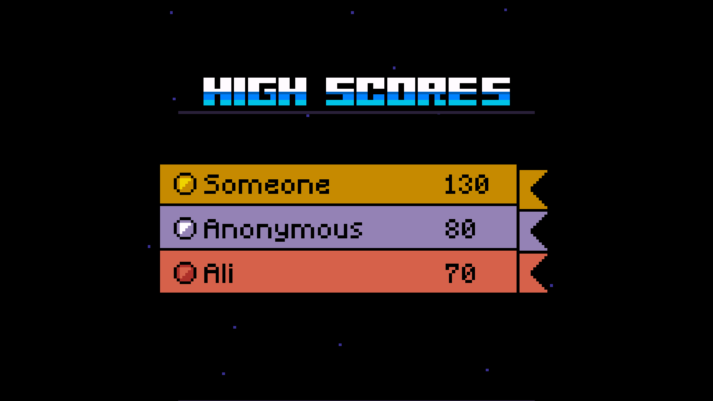

# Tetris Game

A classic Tetris clone written in C++, featuring configurable options, persistent settings, and high-score tracking.

## Demo

  
  
  
  
  

## Features

- **All three Drops** - Hold/Tap/Instant
- **Hold a Block** – store one piece for later use
- **Level-Based Speed** – pieces fall faster as you clear levels  
- **Initial Level** – set your starting level in **Options**  
- **Persistent Options**  
  - Settings are saved to `option.txt` on exit  
  - Loaded automatically on next launch  
- **High-Score Tracking**  
  - Scores saved on exit and loaded on next launch  
- **Music Toggle** – turn background music on or off in **Options**  
- **Next Pieces Preview** – see the next 3 blocks in the sidebar  
- **Drop Highlighting** – shows where a piece will land  

## Installation

1. Clone this repo:
   ```bash
   git clone https://github.com/thequantumcog/OOP-Project.git
   cd tetris-game
   ```
2. Build:
    ```bash
    make
    ```
3. Run:
    ```bash
    ./tetris
    ```
## Controls

- ← / → : Move piece left/right

- ↑ : Rotate piece

- ↓ : Soft drop (hold for continuous soft drop)

- Space : Hard drop

- Z : Hold current piece

